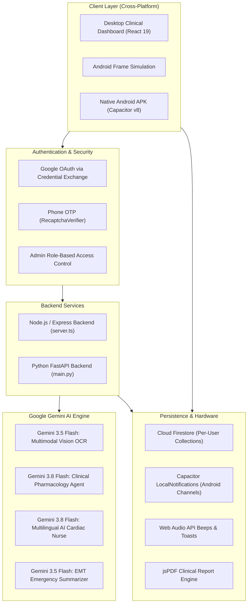
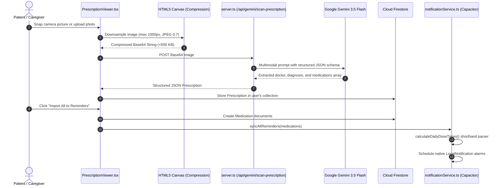
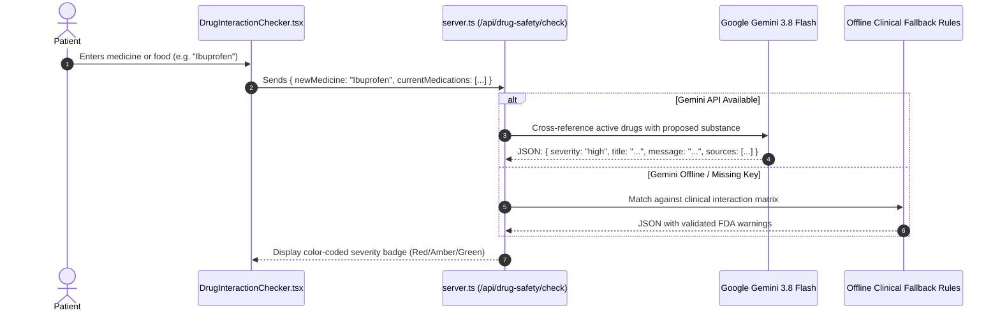

# 🫀 CardioGuard AI — Hackathon Master Codebase Guide & Pitch Deck

> **"An intelligent, end-to-end cardiovascular management and emergency response ecosystem powered by Multimodal Google Gemini, Capacitor Android, and Firebase."**

---

## 📌 Table of Contents
1. [Executive Summary & Problem Statement](#1-executive-summary--problem-statement)
2. [Complete System Architecture](#2-complete-system-architecture)
3. [Technology Stack Breakdown](#3-technology-stack-breakdown)
4. [File-by-File Codebase Anatomy](#4-file-by-file-codebase-anatomy)
5. [Core Features & Technical Deep-Dive](#5-core-features--technical-deep-dive)
   - [5.1 AI Prescription Scanner (Gemini Vision OCR)](#51-ai-prescription-scanner-gemini-vision-ocr)
   - [5.2 Clinical Dose Engine & Abbreviation Parser](#52-clinical-dose-engine--abbreviation-parser)
   - [5.3 Drug-Drug & Food Interaction Checker](#53-drug-drug--food-interaction-checker)
   - [5.4 Cardiovascular Vitals & Real-Time ECG Simulation](#54-cardiovascular-vitals--real-time-ecg-simulation)
   - [5.5 Emergency SOS & First-Responder AI Summary](#55-emergency-sos--first-responder-ai-summary)
   - [5.6 Multilingual Cardiac AI Nurse Companion](#56-multilingual-cardiac-ai-nurse-companion)
   - [5.7 Dual Platform UI (Android Simulator + Desktop Dashboard)](#57-dual-platform-ui-android-simulator--desktop-dashboard)
6. [End-to-End Data Flow Diagrams](#6-end-to-end-data-flow-diagrams)
7. [Hackathon Presentation & Live Demo Script (3 Minutes)](#7-hackathon-presentation--live-demo-script-3-minutes)
8. [Setup, Run & Deployment Guide](#8-setup-run--deployment-guide)

---

## 1. Executive Summary & Problem Statement

### ⚠️ The Problem
- **#1 Cause of Death Globally:** Cardiovascular Diseases (CVDs) claim nearly **18 million lives each year**.
- **The Adherence Crisis:** Over **50% of cardiac patients do not take their medications as prescribed**, leading to un-preventable strokes, heart attacks, and hospital readmissions.
- **Prescription Illegibility & Confusion:** Handwritten prescriptions and complex Latin abbreviations (*TDS, BD, QID, 1-0-1*) result in severe medication dosage errors.
- **Fatal Drug Interactions:** High-risk cardiac patients often self-medicate with common over-the-counter NSAIDs (like Ibuprofen) or consume grapefruit, causing lethal bleeding, hypotensive shock, or rhabdomyolysis.
- **Emergency Room Data Blindspot:** When a patient collapses, EMTs and ER doctors spend critical "golden minutes" guessing their active medications, allergies, and baseline vitals.

### 💡 The Solution: CardioGuard AI
**CardioGuard AI** bridges the gap between doctors, patients, and emergency responders:
- **Scans & Decodes Prescriptions:** Uses Gemini Vision to instantly extract complex handwritten medications and auto-schedules reminders.
- **Parses Medical Shorthand:** Translates clinical frequencies (`BD`, `TDS`, `Q6H`) into precise 24-hour alarm schedules.
- **Clinical Drug Guardian:** Real-time AI cross-checking of new medicines and dietary items against active cardiac regimens.
- **One-Tap Emergency SOS & EMT Report:** Delivers an instant AI-synthesized clinical summary and PDF export for first responders.
- **Native Android + Web Dashboard:** Runs as a responsive desktop dashboard or a native Android app via Capacitor with local hardware alarms.

---

## 2. Complete System Architecture



---

## 3. Technology Stack Breakdown

| Layer | Technologies Used | Purpose |
| :--- | :--- | :--- |
| **Frontend Framework** | React 19, TypeScript, Vite 6 | High-speed SPA rendering, strict type safety, fast HMR |
| **Styling & Icons** | Tailwind CSS v4, Lucide React, Motion | Clean modern medical UI, micro-animations, glassmorphism |
| **Mobile Runtime** | Capacitor 8 (`@capacitor/android`, `@capacitor/core`) | Bridges web code to native Android APIs (Alarms, Notifications) |
| **Mobile Notifications**| `@capacitor/local-notifications` | Native Android alarm channels, persistent lockscreen reminders |
| **AI / Multimodal** | Google Gemini API (`@google/genai` SDK v2.4.0) | Vision OCR, drug interaction checks, nurse chat, EMT summaries |
| **AI Models Used** | `gemini-2.5-flash` | Low latency, high reasoning fidelity for medical schemas |
| **Primary Backend** | Node.js, Express, tsx, Vite Middleware (`server.ts`) | Unified dev/prod server, Gemini proxy, SSR/SPA routing |
| **Microservice Backend**| Python 3, FastAPI, Uvicorn, Pydantic (`main.py`) | Alternative lightweight Python AI REST API with CORS |
| **Cloud Database** | Firebase Cloud Firestore v12 | Real-time cloud sync for meds, vitals, prescriptions, settings |
| **Authentication** | Firebase Authentication | Google Sign-in (native credential token exchange) + Phone OTP |
| **Data Visualization** | Recharts 3.9, HTML5 Canvas | Area charts for BP/Heart rate/Weight + Real-time ECG rhythm simulation |
| **Document Export** | jsPDF 4.2 | Client-side vector PDF generation for emergency health summaries |

---

## 4. File-by-File Codebase Anatomy

### 📁 Root Directory
- [`package.json`](file:///c:/CARDIOGUARD/package.json): Defines dependencies (React 19, `@google/genai`, Capacitor 8, Firebase 12, Tailwind CSS 4) and run scripts (`dev`, `build`, `android:sync`, `android:open`).
- [`server.ts`](file:///c:/CARDIOGUARD/server.ts): The primary Node/Express server. Integrates Vite middleware in development, handles API endpoints for Gemini chat, prescription scanning, drug safety analysis, and serves static files in production.
- [`capacitor.config.ts`](file:///c:/CARDIOGUARD/capacitor.config.ts): Configuration for Capacitor native build (App ID: `com.cardioguard.ai`, App Name: `CardioGuard AI`, custom notification icon, Firebase native authentication settings).
- [`vite.config.ts`](file:///c:/CARDIOGUARD/vite.config.ts): Vite build configuration with React plugin and Tailwind CSS v4 plugin.
- [`start.bat`](file:///c:/CARDIOGUARD/start.bat): Windows one-click startup script that checks Node, installs dependencies, and boots the development server.

---

### 📁 `fastapi-backend/` (Alternative Python AI Microservice)
- [`fastapi-backend/main.py`](file:///c:/CARDIOGUARD/fastapi-backend/main.py): Full FastAPI server implementing REST endpoints for medications, prescriptions, vitals, and Gemini chat interaction with Pydantic validation schemas.
- [`fastapi-backend/requirements.txt`](file:///c:/CARDIOGUARD/fastapi-backend/requirements.txt): Python dependencies (`fastapi`, `uvicorn`, `pydantic`, `google-genai`).

---

### 📁 `src/` (Core Application Source)
- [`src/main.tsx`](file:///c:/CARDIOGUARD/src/main.tsx): React root mount point with StrictMode.
- [`src/types.ts`](file:///c:/CARDIOGUARD/src/types.ts): TypeScript type definitions (`Medication`, `Prescription`, `VitalSign`, `ChatMessage`).
- [`src/firebase.ts`](file:///c:/CARDIOGUARD/src/firebase.ts): Firebase app initialization, Firestore database exports, Google Auth Provider, Recaptcha setup for Phone OTP.
- [`src/App.tsx`](file:///c:/CARDIOGUARD/src/App.tsx): Master application state coordinator:
  - User authentication state listener & role-based admin verification.
  - Per-user Firestore data synchronization (medications, vitals, prescriptions, emergency configuration).
  - Platform mode switcher (Desktop Clinical Dashboard vs Android Smartphone Frame).
  - Local timezone-aware date calculations (`getLocalDateStr`) to prevent UTC midnight reset bugs.
  - Automatic native notification synchronization whenever the medication list changes.

---

### 📁 `src/services/` (Services & Background Logic)
- [`src/services/notificationService.ts`](file:///c:/CARDIOGUARD/src/services/notificationService.ts):
  - Manages native Android notification channels (`cardioguard_med_alarms`) with high priority, audio, and vibration.
  - Generates deterministic 32-bit integer IDs from medication string hashes.
  - `parseTimeToHourMinute`: Intelligently parses 12-hour ("08:00 AM"), 24-hour ("14:30"), and word-based ("Morning", "Night") timestamps.
  - `calculateDailyDoseTimes`: Decodes clinical Latin abbreviations (`BD`, `TDS`, `QID`, `1-0-1`, `Q6H`) and evenly distributes doses over 24 hours.
  - Handles notification action listeners (`TAKE_MED` and `SNOOZE_15`).

---

### 📁 `src/components/` (UI Components)

| Component | File Path | Key Responsibilities |
| :--- | :--- | :--- |
| **MedicationManager** | [`MedicationManager.tsx`](file:///c:/CARDIOGUARD/src/components/MedicationManager.tsx) | Medication tracking, daily check-off, pill inventory management, reminder toggles, filter tabs (Today, Week, Month). |
| **PrescriptionViewer** | [`PrescriptionViewer.tsx`](file:///c:/CARDIOGUARD/src/components/PrescriptionViewer.tsx) | Live camera feed / file upload, client-side canvas image downsampling, Gemini Vision OCR extraction, 1-click import into medication reminders. |
| **DrugInteractionChecker** | [`DrugInteractionChecker.tsx`](file:///c:/CARDIOGUARD/src/components/DrugInteractionChecker.tsx) | Real-time safety cross-examination of active medicines against new drugs/foods with severity grading (High, Medium, None) and pharmacological citations. |
| **VitalsTracker** | [`VitalsTracker.tsx`](file:///c:/CARDIOGUARD/src/components/VitalsTracker.tsx) | Vital sign logging (BP, HR, SpO2, Weight), Recharts interactive trend lines, live simulated ECG rhythm waveform using `requestAnimationFrame`. |
| **EmergencyCenter** | [`EmergencyCenter.tsx`](file:///c:/CARDIOGUARD/src/components/EmergencyCenter.tsx) | One-touch SOS dialer (112, 911, 999, 102), trusted family contact dialer, AI first-responder emergency health summary generator, instant vector PDF export. |
| **AiCompanion** | [`AiCompanion.tsx`](file:///c:/CARDIOGUARD/src/components/AiCompanion.tsx) | Empathetic virtual cardiac nurse powered by Gemini 3.8 Flash. Multi-lingual support (English, Hindi, Hinglish), quick-prompt chips, acute cardiac emergency triage warnings. |
| **AndroidFrame** | [`AndroidFrame.tsx`](file:///c:/CARDIOGUARD/src/components/AndroidFrame.tsx) | Realistic smartphone container with notch, status bar, and bottom navigation tabs for showcasing mobile behavior on any web browser. |
| **DesktopDashboard** | [`DesktopDashboard.tsx`](file:///c:/CARDIOGUARD/src/components/DesktopDashboard.tsx) | High-productivity 4-column clinical layout for desktop users displaying adherence progress, vitals, prescriptions, and AI assistant simultaneously. |
| **AuthScreen** | [`AuthScreen.tsx`](file:///c:/CARDIOGUARD/src/components/AuthScreen.tsx) | Clean login/registration supporting Google Sign-In with native credential bridge, SMS Phone OTP, and a reviewer bypass for testing. |
| **SettingsModal** | [`SettingsModal.tsx`](file:///c:/CARDIOGUARD/src/components/SettingsModal.tsx) | Management of user clinical profile (declared chronic diseases, allergies, emergency contacts) and notification preferences with test alarm triggers. |
| **AdminPanel** | [`AdminPanel.tsx`](file:///c:/CARDIOGUARD/src/components/AdminPanel.tsx) | Administrative cockpit: telemetry metrics, patient list, compliance rates, emergency broadcast simulations, and database health audits. |

---

## 5. Core Features & Technical Deep-Dive

### 5.1 AI Prescription Scanner (Gemini Vision OCR)
1. **Camera / Upload Capture:** The user snaps a picture using their smartphone camera or uploads a saved doctor's prescription slip via `navigator.mediaDevices.getUserMedia`.
2. **Client-Side Compression (`resizeImage`):** Cloud Firestore limits individual documents to 1 MiB. The component renders the image to an HTML5 Canvas, downsamples it to a maximum width of 1000px, and encodes it as JPEG (quality 0.7) to ensure instant network transfer and safe Firestore persistence.
3. **Multimodal Extraction:** The base64 payload is transmitted to `/api/gemini/scan-prescription` on `server.ts`.
4. **Structured JSON Output:** The Gemini model (`gemini-2.5-flash`) processes the handwriting and returns a strictly typed JSON object:
   ```json
   {
     "doctorName": "Dr. Sarah Jenkins, MD",
     "doctorSpecialty": "Cardiologist",
     "date": "2026-07-03",
     "diagnosis": "Hypertension & Stage 1 Left Ventricular Dysfunction",
     "notes": "Monitor sodium intake. Avoid NSAIDs.",
     "medications": [
       {
         "name": "Metoprolol Succinate",
         "dosage": "50mg",
         "frequency": "Once Daily (Morning)",
         "duration": "90 Days"
       }
     ]
   }
   ```
5. **1-Click Conversion to Active Reminders:** A user can click **"Import All to Reminders"**, which immediately adds the extracted medications into the user's active medication database and schedules device alarms.

---

### 5.2 Clinical Dose Engine & Abbreviation Parser
Doctors frequently use Latin abbreviations on prescription slips rather than explicit timestamps. CardioGuard's [`calculateDailyDoseTimes`](file:///c:/CARDIOGUARD/src/services/notificationService.ts#L70) function translates medical shorthand into exact alarm schedules:

| Shorthand / Frequency | Medical Meaning | CardioGuard AI Schedule |
| :--- | :--- | :--- |
| `QID`, `4X`, `1-1-1-1`, `Q6H` | 4 times daily (every 6 hrs) | `06:00 AM, 12:00 PM, 06:00 PM, 12:00 AM` |
| `TDS`, `TID`, `3X`, `1-1-1`, `Q8H` | 3 times daily (every 8 hrs) | `08:00 AM, 02:00 PM, 08:00 PM` |
| `BD`, `BID`, `2X`, `1-0-1`, `Q12H` | Twice daily (every 12 hrs) | `08:00 AM, 08:00 PM` |
| `OD`, `Once Daily`, `1-0-0` | Once daily (Morning) | `08:00 AM` |
| `Night`, `Bedtime`, `HS`, `0-0-1` | Once daily at bedtime | `09:00 PM` |

---

### 5.3 Drug-Drug & Food Interaction Checker
When a cardiac patient wants to take an over-the-counter medicine (e.g., headache pills, cold medicine, supplements), they type it into the **Drug Interaction Checker**.

1. **Active Medication Context:** The app packages the patient's entire active medication list (`[Metoprolol 50mg, Lisinopril 10mg, Aspirin 81mg]`).
2. **Gemini Clinical Reasoning (`gemini-3.8-flash`):** The LLM acts as an expert clinical pharmacologist, cross-referencing against clinical databases like DDInter, RxNorm, and OpenFDA.
3. **Deterministic Offline Safeguards:** If the server is offline or the Gemini API key is unavailable, deterministic hardcoded clinical rules immediately safeguard the user:
   - **Aspirin + Ibuprofen:** Flags severe risk of GI ulceration/bleeding and loss of cardioprotective antiplatelet effects.
   - **Lisinopril + NSAIDs:** Flags acute kidney injury (renal impairment) and blunting of antihypertensive control.
   - **Atorvastatin + Grapefruit:** Flags CYP3A4 enzyme inhibition causing toxic statin accumulation and rhabdomyolysis.
   - **Nitrates + Sildenafil (Viagra):** Flags fatal hypotensive collapse.

---

### 5.4 Cardiovascular Vitals & Real-Time ECG Simulation
- **Vitals Logging:** Captures Heart Rate (BPM), Blood Pressure (Systolic & Diastolic in mmHg), Oxygen Saturation (SpO2 %), and Body Weight (kg).
- **Interactive Trend Charts:** Built with `recharts` using smooth responsive SVG curves and gradient shading to highlight blood pressure staging (Normal vs Elevated vs Stage 1/2 Hypertension).
- **Live Canvas ECG Waveform:**
  - A real-time cardiac rhythm strip rendered at 60 FPS using `requestAnimationFrame`.
  - Implements the classic P-Q-R-S-T cardiac wave pattern with physiological random micro-variance to provide an authentic ICU/telemetry monitor visual experience.

---

### 5.5 Emergency SOS & First-Responder AI Summary
When a cardiovascular crisis strikes, standard medical apps fail because they require too much navigation. CardioGuard AI provides a dedicated **Emergency Center**:
1. **1-Click Call:** Triggers immediate telephone dialing for local emergency response (`112`, `911`, `999`, `102`) and pre-configured trusted family contacts.
2. **AI Emergency Summary Generation:**
   - In 2 seconds, Gemini parses the patient's name, chronic conditions, active life-support drugs, recent vitals, and allergies into an ultra-concise, non-jargon, 200-word bulleted report.
   - Specifically formats the output so an EMT or triage nurse standing beside an ambulance can assess cardiac stability in under 5 seconds.
3. **Instant Vector PDF:** Using `jspdf`, the app generates a clean, printable vector PDF document containing the emergency summary, medication routine, and contact numbers.

---

### 5.6 Multilingual Cardiac AI Nurse Companion
- **Conversational Care:** Acts as an empathetic, always-available cardiac nurse.
- **Multilingual Understanding:** If a user speaks in Hindi, Hinglish, Spanish, or English, the system responds naturally in the user's preferred language.
- **Emergency Triage Guardrail:**
  ```typescript
  // Safety rule enforced in both Node & Python backends:
  if (lastMsg.toLowerCase().includes("pain") || lastMsg.toLowerCase().includes("chest")) {
    // Immediately display emergency warning banner urging user to dial 911 / stop chatting
  }
  ```

---

### 5.7 Dual Platform UI (Android Simulator + Desktop Dashboard)
- **Android Smartphone Frame:** Demonstrates how the app looks and feels in a native mobile environment with realistic device status bar, notch, and bottom tab navigation.
- **Desktop Clinical Dashboard:** An expansive 4-column productivity view suited for doctors, nurses, or patients at home on a computer or tablet.

---

## 6. End-to-End Data Flow Diagrams

### Prescription Scanning to Alarm Scheduling Flow


---

### Drug Interaction Safety Check Flow


---

## 7. Hackathon Presentation & Live Demo Script (3 Minutes)

Use this step-by-step presentation script when pitching to hackathon judges:

### ⏱️ Minute 0:00 - 0:45 | The Hook & The Problem
> *"Judges, cardiovascular disease is the world's number one killer, claiming 18 million lives every year. But here is the most heartbreaking statistic: more than half of all cardiac complications happen simply because patients struggle to manage complicated prescriptions, misread Latin doctor shorthand, or accidentally take dangerous over-the-counter medicines like Ibuprofen with their blood thinners.*
> 
> *Today, we built **CardioGuard AI** — an intelligent cardiovascular companion and emergency response system."*

### ⏱️ Minute 0:45 - 1:30 | The Magic Demo: Multimodal Prescription Scanning
> *(Action: Open Prescription Viewer, click 'Scan Doctor Prescription', upload/snap a prescription slip).*
> *"Watch this. Here is a messy, real-world doctor's prescription. With one click, CardioGuard uses **Google Gemini Multimodal Vision** to read the handwriting, extract the doctor's name, diagnosis, and every prescribed cardiac drug. Notice how it automatically translates medical shorthand like 'BD' and '1-0-1' into exact 8:00 AM and 8:00 PM alarm schedules. With one tap — 'Import All' — they are instantly synced to hardware alarms on the patient's Android phone."*

### ⏱️ Minute 1:30 - 2:15 | Drug Safety & Real-Time Telemetry
> *(Action: Switch to Drug Safety Checker, type 'Ibuprofen').*
> *"Next: Drug safety. Cardiac patients take Beta-Blockers and Aspirin. What happens if they get a headache and want to take Ibuprofen? Our Gemini Clinical Engine immediately flags a severe interaction: Ibuprofen blunts blood pressure medication and drastically spikes gastrointestinal bleeding risks.*
> 
> *(Action: Switch to Vitals Tracker).*
> *Our vitals tracker features interactive blood pressure staging and a real-time, 60-FPS simulated ECG rhythm monitor."*

### ⏱️ Minute 2:15 - 3:00 | The Lifesaver: Emergency SOS & AI EMT Report
> *(Action: Click the red SOS button).*
> *"Finally, when seconds count, CardioGuard's Emergency Center provides one-tap SOS dialing. More importantly, Gemini synthesizes a 200-word First-Responder Emergency Summary highlighting active life-support drugs, allergies, and recent vitals, exportable instantly as a PDF for the paramedic crew.*
> 
> *CardioGuard AI runs seamlessly on both Android devices and desktop clinical dashboards. The work of our app may look very simple but every seconds matter every medications counts , we have big plans for this app and we believe it can make a big difference in the world, It doesn't just remind patients — it saves lives. Thank you!"*

---

## 8. Setup, Run & Deployment Guide

### Prerequisites
- **Node.js**: v18.0.0 or higher installed.
- **Gemini API Key**: Obtain a free API key from [Google AI Studio](https://aistudio.google.com/).

### Quickstart (Node.js & React Frontend)
1. **Clone & Install Dependencies:**
   ```bash
   git clone <repository_url>
   cd CARDIOGUARD
   npm install
   ```

2. **Configure Environment Variables:**
   Create a `.env` file in the root directory:
   ```env
   GEMINI_API_KEY=your_gemini_api_key_here
   PORT=3000
   ```

3. **Start the Development Server:**
   ```bash
   npm run dev
   ```
   Open your browser at: `http://localhost:3000`

---

### Running the Native Android App (Capacitor)
1. **Build the web production bundle:**
   ```bash
   npm run build
   ```
2. **Synchronize assets to the Android project:**
   ```bash
   npx cap sync android
   ```
3. **Open the project in Android Studio:**
   ```bash
   npx cap open android
   ```
4. Run on a connected Android phone or emulator to test hardware alarms and Google Authentication.

---

### Running the Python FastAPI Backend (Optional)
If you wish to run the Python microservice:
1. Navigate to the backend directory:
   ```bash
   cd fastapi-backend
   ```
2. Install Python dependencies:
   ```bash
   pip install -r requirements.txt
   ```
3. Run with Uvicorn:
   ```bash
   uvicorn main:app --reload --port 8000
   ```
   Interactive Swagger API documentation will be available at: `http://localhost:8000/docs`

---

<div align="center">
  <b>Built with ❤️ for Cardiovascular Health & Innovation</b><br/>
  <i>CardioGuard AI — Keeping Hearts Beating Safely.</i>
</div>
